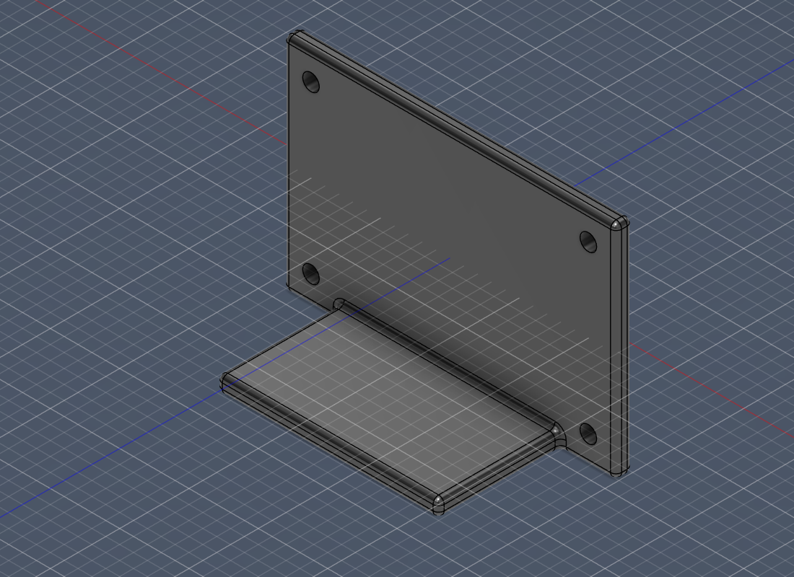
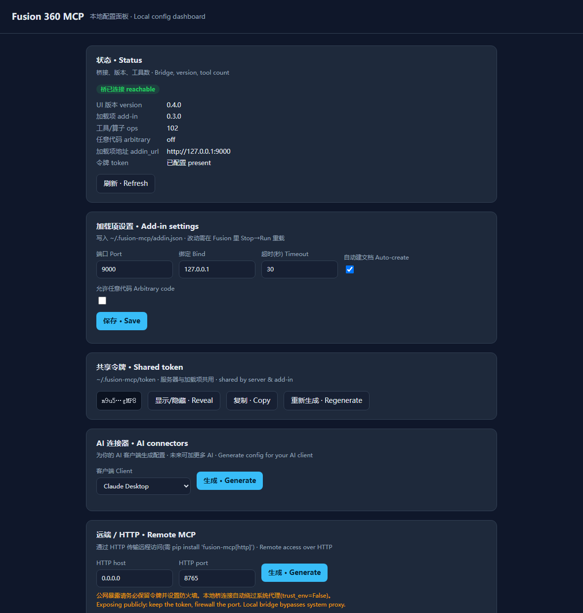

# self-host-fusion360-mcp

**A self-hosted, unified MCP server that lets Claude (or any MCP client) drive Autodesk Fusion 360 on your own machine.**

[简体中文](README.zh-CN.md) · [Full manual](docs/manual.en.md) · [Tool reference](docs/TOOLS.md) · [Troubleshooting](docs/TROUBLESHOOTING.en.md)



<sub>An L-bracket built entirely from a Claude conversation through this MCP — base + wall + boolean join + fillets + 4 mounting holes + mass check + export. See [scripts/demo_conversation.py](scripts/demo_conversation.py).</sub>

It unifies the best ideas from the community Fusion-MCP projects into one well-documented, foolproof package: **bilingual docs (中/英), a Windows one-click installer, Docker one-command run, mm-first units, a shared auto-generated token, ~100 tools (plus a generic-API escape hatch for full coverage), auto-create-document, and a `doctor` that tells you exactly what's wrong.** No Fusion subscription required — it works with the free personal-use license too.

> ✅ **Validated against a real Fusion 360 install** (Jan 2026 build, Python 3.14): a 57-step coverage test and a full bolt-circle-flange build pass end-to-end, with numerically-verified mass/volume. See [Development & testing](#development--testing).

---

## How it works (read this first)

Fusion's `adsk.*` API can only be called **inside Fusion, on its main thread** — no external process can touch it directly. So this project has **two parts**:

```
┌────────────────┐   MCP (stdio / http)   ┌─────────────────────┐  HTTP + token   ┌──────────────────────────┐
│ Claude          │ ─────────────────────▶ │  MCP server          │ ──────────────▶ │  Fusion add-in (in-process)│
│ Desktop / Code  │ ◀───────────────────── │  (this repo, server/) │ ◀────────────── │  (this repo, addin/)       │
└────────────────┘                         │  native OR Docker     │                 │  127.0.0.1, main thread    │
                                            └─────────────────────┘                 └─────────────┬────────────┘
                                                                                                  │ adsk.* API
                                                                                            ┌─────▼─────┐
                                                                                            │ Fusion 360 │
                                                                                            └───────────┘
```

> ⚠️ **Fusion cannot run in Docker.** It is a desktop GUI app. Docker only containerizes the **MCP server**; the **add-in must run inside Fusion on the host**. In Docker the server reaches the host add-in via `host.docker.internal`. This is the single most common point of confusion — the installer and `doctor` keep reminding you.

---

## Features

- **Two transports** — `stdio` (Claude Desktop / Claude Code) and `streamable-http` (Docker / remote).
- **~100 tools** — one-call primitives (box/cylinder/sphere), sketches (rect/circle/line/arc/polygon/spline, on construction planes *or* body faces) **with constraints & dimensions** for robust parametric sketches, extrude/revolve/sweep/loft, fillet/chamfer/shell/holes/draft/scale, split/offset faces, threads, rectangular & circular patterns, mirror, boolean combine, parameters, body ops, construction planes, appearances, surfaces (patch/thicken/ruled/stitch), inspection (physical properties, min-distance, angle, interference, face listing), timeline edit (undo/redo/suppress), export (STL/STEP/F3D/DXF), viewport screenshots Claude can *see*, units, **assembly** (components, joints, rigid groups), and **CAM** (setups, operations, tool assignment, toolpaths, G-code post).
- **Generic API escape hatch** — `fusion_api_call` / `fusion_api_introspect` / `fusion_api_docs` reach *any* `adsk.*` method by path (full coverage for anything not covered by a curated tool). Gated behind allow_arbitrary_code.
- **Auto-create document** — build tools make a new design if none is open; no community server does this.
- **mm-first** — every dimension is millimetres; the cm conversion is done once, at the boundary (no 10× bugs).
- **Tool annotations** — read-only/destructive/idempotent hints so clients can auto-approve safe calls.
- **Foolproof setup** — auto-generated shared token (never copied by hand), safe Claude-config merge (your other servers are preserved), idempotent installer, UTF-8/GBK handling for Chinese Windows.
- **Web config dashboard** — `fusion-mcp webui` opens a local browser UI to see status, edit settings, manage the token, and generate/apply MCP client config for multiple AIs (Claude Desktop/Code, Cursor, VS Code, generic, remote HTTP). Loopback-only, zero new deps.
- **`doctor`** — bilingual diagnostics that pinpoint connection/token/version problems.
- **Mock mode** — run the server, tests, and Docker image with **no Fusion installed**.
- **Bilingual docs** — everything in English and 简体中文.
- **Safe by default** — the arbitrary-code tool is **off** unless you explicitly enable it.

---

## Quickstart

### Option A — Windows one-click (recommended)

1. Install Fusion 360 and [Python 3.10+](https://www.python.org/downloads/) (tick *Add to PATH*).
2. Double-click **`install/windows-install.bat`** (or run `install/windows-install.ps1` in PowerShell).
   It copies the add-in into Fusion, generates the token, installs the server, and merges your Claude Desktop config.
3. Start Fusion 360, open a design, then go to **Utilities → ADD-INS → Scripts and Add-Ins**, select **Fusion360MCP**, and click **Run** (set it to *Run on Startup* to skip this next time).
4. Fully quit and reopen **Claude Desktop**. Ask: *"Create a 20×20×10 mm box in Fusion and add 2 mm fillets."*

### Option B — Docker (server in a container)

The add-in still installs on the host (steps 1–3 above, or just copy `addin/Fusion360MCP/` into your Fusion `API/AddIns` folder). Then:

```bash
cp .env.example .env          # set FUSION_MCP_TOKEN to the host token (~/.fusion-mcp/token)
docker compose up -d          # server listens on http://localhost:8765/mcp
docker compose run --rm fusion-mcp fusion-mcp doctor   # verify
```

Add it to Claude as a custom (remote/HTTP) connector pointing at `http://localhost:8765/mcp`.

### Option C — Manual / cross-platform

```bash
pip install -e .                         # or: pip install -e ".[http,dev]"
cp addin/Fusion360MCP  ->  <Fusion>/API/AddIns/   # copy the add-in folder
fusion-mcp doctor                        # diagnose
fusion-mcp run                           # stdio (configure your client to launch this)
```

See the [full manual](docs/manual.en.md) for the exact Claude config JSON and the Fusion AddIns paths.

### Web config dashboard

```bash
fusion-mcp webui          # opens http://127.0.0.1:8088 in your browser
```

A local, loopback-only page to: check bridge status, edit add-in settings, view/
regenerate the token, and **generate or one-click-apply** MCP client config for
Claude Desktop, Claude Code, Cursor, VS Code, a generic client, or a remote/HTTP
connector. Adding a future AI = one entry in `fusion_mcp.clientconfig.CONNECTORS`.



---

## Configuration

All optional; defaults shown. See [.env.example](.env.example).

| Variable | Default | Meaning |
|---|---|---|
| `FUSION_ADDIN_URL` | `http://127.0.0.1:9000` | Where the server reaches the add-in (`http://host.docker.internal:9000` in Docker) |
| `FUSION_MCP_TOKEN` / `FUSION_MCP_TOKEN_FILE` | `~/.fusion-mcp/token` | Shared bearer token (resolution order) |
| `FUSION_MCP_TRANSPORT` | `stdio` | `stdio` or `http` |
| `FUSION_MCP_HTTP_HOST` / `_PORT` | `0.0.0.0` / `8765` | HTTP bind (http transport) |
| `FUSION_MCP_ALLOW_ARBITRARY_CODE` | `0` | Expose `fusion_run_script` (risky) |
| `FUSION_MCP_MOCK` | `0` | Run without Fusion |

---

## Safety & limitations

- **Verify everything.** Claude is great at prismatic/parametric parts and repetitive edits, weaker at organic/freeform surfaces. A 0.1 mm slip breaks a fit — review (and ideally print) before trusting output.
- The connector **mutates your live model**. Save a version before batch operations.
- `fusion_run_script` runs arbitrary Python in Fusion; it is disabled unless you opt in.
- The bridge binds to `127.0.0.1` and requires a bearer token. Read [docs/TROUBLESHOOTING](docs/TROUBLESHOOTING.en.md) before exposing it to Docker/other hosts.
- **License limits:** IGES/SAT export is blocked on **personal-use** Fusion licenses (the bridge returns a clear hint); STEP/STL/F3D work on all licenses. 3MF has no Fusion API and is not exposed — use STL for 3D printing.
- **CAM prerequisites:** the `cam_*` tools require the **Manufacturing** workspace to have been opened once (so the CAM product exists); they return a clear hint otherwise. Most operation strategies also need a cutting tool assigned before a toolpath will generate.

---

## Development & testing

Everything below was used to validate the project against a real Fusion 360 install.

```bash
# 1) Call any op directly against the live bridge (reads ~/.fusion-mcp/token)
python scripts/rpc.py health
python scripts/rpc.py primitive.box '{"width":20,"depth":20,"height":20}'

# 2) Comprehensive coverage test (fresh doc -> ~57 checks across every tool)
python scripts/smoketest.py

# 3) Realistic end-to-end part: a bolt-circle flange (+ inspection & export)
python scripts/demo_flange.py        # writes screenshots/flange.png

# 4) Mock unit tests (no Fusion needed)
python -m pytest -q
```

**Hot-reload loop (no Fusion restart).** The add-in entry purges its package
modules on Stop→Run, and a dev-only `system.reload` op re-imports *all* op code —
including `_common` — in place. So the edit→test cycle is:

```bash
cp -r addin/Fusion360MCP/. "$APPDATA/Autodesk/Autodesk Fusion 360/API/AddIns/Fusion360MCP/"
python scripts/rpc.py system.reload   # live-reload edited add-in code
python scripts/smoketest.py           # re-test
```

Only changes to the HTTP/bridge layer (`bridge/`, `config.py`, `__init__.py`)
need a Fusion **Stop→Run**; op edits are picked up by `system.reload`.

---

## Status & roadmap

**Done (v0.5.0)** — every tool below validated against a *real* Fusion 360 install
(Jan 2026 build, Python 3.14):

- **Active component** — build a multi-part model in ONE document: `assembly.activate_component` makes later sketch/feature/primitive ops target that component (each part isolated, existing bodies untouched); default is the root component.
- **Auto-dismiss blocking dialogs** — an external guard process closes save/recover/server-verification/stray modals that would otherwise freeze Fusion (they hold the GIL, so an in-process watchdog can't); safe WM_CLOSE-first, only when an op is stuck or the title matches a nuisance allowlist.
- **`system.restart`** — full in-process reload (incl. bridge/`__init__`) over RPC, so code changes apply **without a manual Fusion Stop→Run**.


- Two-part architecture (in-Fusion add-in bridge + external MCP server); **stdio**
  and **streamable-http** transports; **mock mode** (no Fusion needed).
- **~100 tools**: primitives; sketches **with constraints & dimensions**; extrude/
  revolve/sweep/loft; fillet/chamfer/shell/hole/draft/split/offset-faces/thread/
  scale; rectangular & circular patterns; mirror; boolean combine; surfaces
  (patch/thicken/ruled/stitch); parameters; body ops; construction planes;
  appearances; inspection (mass, min-distance, angle, interference, face listing);
  timeline edit (undo/redo/suppress); export (STL/STEP/F3D/DXF); viewport
  screenshots; units; **assembly** (components, joints incl. by-face, rigid groups);
  **CAM** (setups, operations, auto tool-assignment, toolpaths, G-code post).
- **Generic API** escape hatch (`api.call`/`introspect`/`docs`, gated) for full coverage.
- Auto-create-document, mm-first units, mutation `_delta` feedback, bilingual hints.
- Foolproof **Windows installer**, **Docker**, `doctor`, **hot-reload** dev loop.
- **Web config dashboard** (`fusion-mcp webui`) + multi-AI connector registry.
- 28 mock tests; full bilingual docs.

**Roadmap / TODO:**

- [ ] CAM end-to-end validated (needs Manufacturing workspace + tool library): setup → operation → toolpath → G-code.
- [ ] Curated **sheet-metal creation** — currently blocked by the Fusion API (no create methods on FlangeFeatures/BendFeatures); revisit if Autodesk exposes it. (Only `create_flat_pattern` on existing SM bodies works today.)
- [ ] Joints by **edge / axis**, joint limits & motion.
- [ ] **Drawings** (2D drawing docs, auto views) + richer DXF/PDF export.
- [ ] "Apply config" write-through for **Cursor / VS Code** (not just Claude Desktop).
- [ ] One-click **webui launcher** (`.bat`) + optional system-tray.
- [ ] **macOS installer** (`.command`) at parity with the Windows installer.
- [ ] Publish to **PyPI** (`uvx fusion-mcp`) + signed release.
- [ ] Tests for the **webui API** + more op-level mocks.
- [ ] More **AI connectors** as the ecosystem grows.

## Project layout

```
addin/Fusion360MCP/   In-Fusion add-in (pure stdlib): HTTP bridge + main-thread dispatch + ops
server/fusion_mcp/    MCP server: FastMCP app, tools, client, doctor, CLI
install/              Windows installer, token gen, safe Claude-config merge
docs/                 Bilingual manual, architecture, tool reference, troubleshooting
scripts/              Dev helpers: rpc.py, smoketest.py, demo_flange.py, doctor, gen_tools_doc
tests/                Mock-driven tests (no Fusion needed)
```

## License

MIT — see [LICENSE](LICENSE). Not affiliated with or endorsed by Autodesk or Anthropic.
